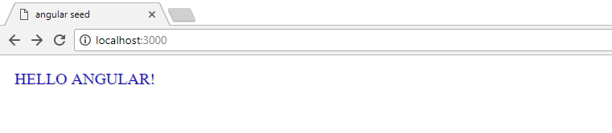

# Angular Seed

> Angular application template using webpack and npm scripts. Along with Karma and Jasmine setup for testing.

## Setup

* Install node.js (http://nodejs.org)
* Clone repository

## Installation

* Install package manager by running the following command in the terminal:

```
npm i -g yarn
```

* Then _cd_ into cloned project directory and run the below command to install required project dependencies:

```
yarn install
```

## Run Project

* Development
  > Runs using webpack's dev server in which all processed files are located in a virtual distribution folder, defaults to http://localhost:3000/

```
yarn start
```

* Production
  > Runs a prebuild process which installs required dependencies and runs application tests. The distribution folder is then cleaned before newly processed files are added.

```
yarn run build
```

## Sample Screenshot

> On application start up you should see the below.


